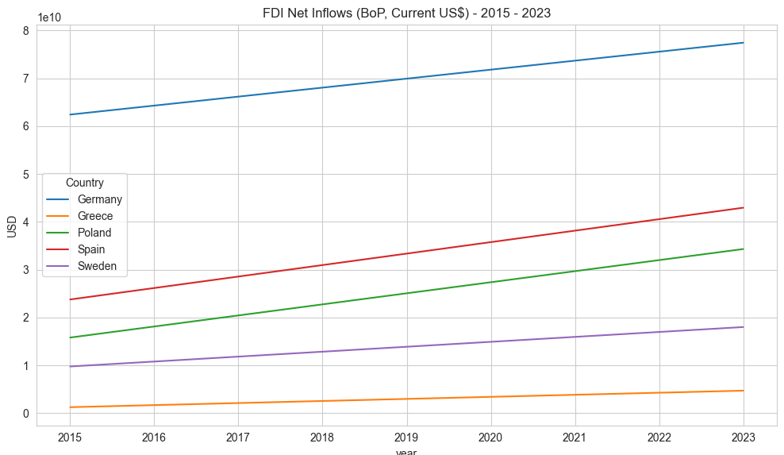

# Balance of Payments Analysis (2015–2023)

**Countries Analyzed:** Germany, Spain, Sweden, Poland, Greece  
**Tools Used:** Python (`pandas`, `seaborn`, `matplotlib`)  
**Data Source:** IMF World Economic Outlook Database  

---

## Objective

To analyze and compare the Balance of Payments trends for five European countries between 2015 and 2023, focusing on:

- **Current Account Balance**
- **Exports vs Imports (Trade Balance)**
- **Foreign Direct Investment (FDI) Inflows**

---

## Methods

- Reshaped wide-format IMF data into long format using `pd.melt()`
- Cleaned and standardized column names and year values
- Filtered data by key indicators
- Created comparative visualizations across countries and years
- Calculated change between 2015 and 2023

---

## Key Findings

### Current Account Balance
- Germany had the largest surplus and maintained it steadily from 2015 to 2023.
- Spain, Poland, and Sweden showed improvements in their current account positions.
- Greece remained in deficit throughout the period.

### Trade Balance (Exports – Imports)
- Germany continues to dominate with the highest surplus.
- Spain and Poland saw positive trade shifts and rising surpluses.
- Greece showed little change and remained in deficit.

### FDI Inflows (Foreign Direct Investment)
Between 2015 and 2023:
- **Greece** recorded the **highest percentage increase** (+272%), recovering from a low base.
- **Poland** (+117%), **Spain** (+81%), and **Sweden** (+84%) all showed strong FDI growth.
- **Germany**, already a major FDI destination, grew by **24%**, maintaining the highest total inflows.

---

##  Conclusion

This project provides valuable insights into the macroeconomic trends of selected European countries over nearly a decade. Poland, Spain, and Sweden have shown increasing strength in trade and investment, while Germany remains a consistent leader. Greece, despite challenges, is making progress in attracting foreign capital.

